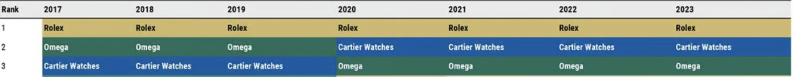
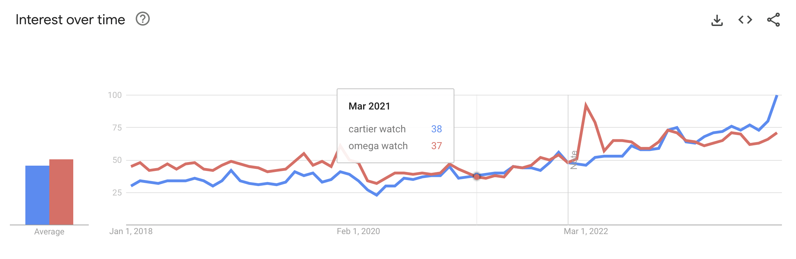

#  Project 3: Web APIs & NLP

# Group 02: 
## Marketing With Data: Employing NLP (Natural Language Processing) to reduce subjectivity in ad creation and evaluation

### Brief background

OMEGA started out in 1848 as a watch workshop and quickly developed into a global watch brand in the 1900s with the start of an olympic legacy, being the sponsor to its sporting events.

The Morgan Stanley's Top 20 Swiss Watch Company Ranking measures the competition within the watch industry annually, in terms of market share, unit sales and revenue, of which OMEGA has historically ranked 2nd. [(Professional Watches, 2024)](https://professionalwatches.com/morgan-stanleys-top-20-swiss-watch-company-ranking-for-2024/)

In 2020, Cartier overtook OMEGA's unchallenged #2 spot and since then consistently ranked 2nd up till 2023. 

Google Search Trends also reflect the popularity of Cartier catching up and overtaking OMEGA between 2018 to 2022. [(Google Search Trends, 2024)](https://trends.google.com/trends/explore?date=2018-01-01%202023-12-31&q=cartier%20watch,omega%20watch&hl=en)

To reclaim their position, OMEGA seeks to pivot their strategy and employ more measured, data-driven methods in organisational decision making.

### Problem Statement

Branding and advertising are facets of the business that has had much trouble employing data-driven methods, especially when it comes to creating and evaluating the effectiveness of text-based communications. 

To date, there are no means to measure with confidence how effective a text copy will be before publishing, and predicted effectiveness is purely based on subjective opinion.

How might we leverage natural language processing to inform our marketing decisions with confidence and objectivity, especially on copy that goes to brand taglines and marketing slogans?

### Dataset

To represent the customer's voice, we scraped 14,000 posts from each subforum (OMEGA and Cartier) of a watch enthusiast forum www.watchuseek.com.

Within each post, the features collected and engineered are as below:
|Feature|Type|Dataset|Description|
|---|---|---|---|
|author|object|df_clean_full.csv|Forum username of the author of each post|
|body|object|df_clean_full.csv|Text written within each post|
|date|datetime|df_clean_full.csv|Date of each post in yyyy-mm-dd|
|like|boolean|df_clean_full.csv|True=the post was liked by another user|
|sentiment|boolean|df_clean_full.csv|Sentiment score of post|

### Modelling
We compared across 2 transformers and 3 classification models as seen in the table below. 

|Transformer|Classification Model|Train Score|Test Score|Sensitivity|
|---|---|---|---|---|
|Count Vectorisation|Naive Bayes|0.8642|0.8357|0.8622|
|Count Vectorisation|Logistic Regression|0.9129|0.8266|0.8444|
|Count Vectorisation|Random Forest|0.7938|0.7795|0.9468|
|TF-IDF Vectorisation|Naive Bayes|0.8778|0.8315|0.8364|
|TF-IDF Vectorisation|Logistic Regression|0.8876|0.8332|0.8844|
|TF-IDF Vectorisation|Random Forest|0.7893|0.7781|0.9733|

Optimising for processing time, sensitivity and model fit, we chose to use Count Vectorisation as our transformer and Naive Bayes as our classification model. After hypertuning, the results are as below.

|Transformer|Classification Model|Train Score|Test Score|Sensitivity|Processing Time|
|---|---|---|---|---|---|
|Count Vectorisation|Naive Bayes|0.8790|0.8349|0.8571|2.44s|
|Count Vectorisation (Tuned)|Naive Bayes (Tuned)|0.8642|0.8357|0.8622|2.16s|

Specifically, we chose sensitivity as our measure of success as our focus is on predicting OMEGA correctly, less on Cartier. In addition, we want to ensure that an OMEGA comment will not be wrongly classified as Cartier.

### Conclusion
After removing common words and noise, our analysis shows that:
1. 1-gram: Both brands' customers share similar sentiments, with slight differences wherein OMEGA customers highlight intricacies of aesthetics while Cartier customers comment more on the overall look, model names for Cartier are more often mentioned.

2. 2-gram: Cartier customers evidently discuss and mention the popular models more, with 8 out of 10 top phrases referring to model names. OMEGA on the other hand have 4 out of 10 mentions of model names in the most mentioned words, while the other phrases continue to discuss other facets of the watch such as the link or strap

3. 3-gram: OMEGA customers continue to show more interest in other facets of the watch such as the bracelet and rubber strap. Interestingly, OMEGA service center appeared as top 3 phrases, mostly commending their service. All of 10 top phrases in Cartier are mentions of model names.

### Recommendations
The model is a proof-of-concept that text effectiveness can be measured, especially when working on high stake advertising or brand campaigns. The model provides multi-fold benefits to organisations that are looking for a way to objectively evaluate if their text-based communications will resonate with their audience in the following aspects:

* Objectivity: Measure how well an ad copy will resonate with your audience
* Direction: Amplify and solidify use of words that are shared languages with customer 
* Confidence: Additional layer of validation to give confidence in publishing an ad
* Timeliness: Reduces time taken to assess and evaluate effectiveness of copy
* Source of Truth: Shared source of truth between client and agency 

### Limitations and Future Enhancements

1. **Limitation**: This classifier only takes into account text from customers between OMEGA and Cartier. While our main competitor is Cartier, we should also take into account other watch brands.

    **Recommendation**: For the future, we will include forum posts from the top 5 watch brands to create a multi-classification model that provides a more robust view of the industry.

2. **Limitation**: The model only takes words that were used in comments, however does not take into account words with similar meanings e.g. precision vs accuracy.

    **Recommendation**: We can explore other transformer libraries such as BERT that is more robust in semantics, contextual meanings and relationship between similar words.

3. **Limitation**: The current model does not take into account sentiment scores, which could help to identify feedback for future campaigns.

    **Recommendation**: A quick addition to the model could show sentiment comparisons between top 5 watch brands.

4. **Limitation**: In its purest form, this model could become a clutch that restricts creativity. Brands and customers also evolve to speak in a way that is never before done.

    **Recommendation**: The typical process taken to develop a creative ad, slogan and tagline should still be common practice as it’s designed with much intention. The model serves only as a layer of validation.

